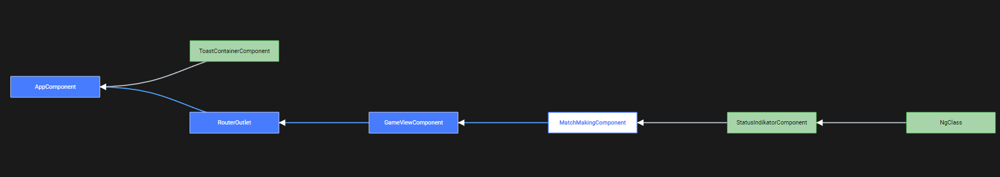

# TicTacToe
Ein WBS2-Projekt von Fatlinda Islami, Mia Balzer, Ramon Biehl und Robin Hahn.

## Nennenswerte Extra-Features

- **Die Game-Ansicht kann während des laufenden Spiels verlassen werden, ohne den Spielfortschritt zu verlieren.**
- **Ein Status-Indikator in der Navbar hält den Nutzer darüber informiert, ob er sich derzeit in der Queue befindet (gelb), ob er spielt und, am Zug ist (grün) oder nicht am Zug ist (rot).**
- **Der Server kann beendet werden oder die Client-Verbindung kann unterbrochen werden, ohne dass laufende Spiele verloren gehen.**
- **Die Queue wird bei Disconnects nicht verlassen; stattdessen gibt es eine Acknowledge-Abfrage, die die Erreichbarkeit des Clients sicherstellt.**
- **Das Spiel kann aufgegeben werden.**
- **Es gibt einen Chat.**
- **Admins können laufenden Spielen zusehen.**
- **Profilbilder werden als separate API-Anfrage gestreamt.**
- **Queue und laufende Spiele werden im Admindashboard bei Änderungen aktualisiert.**

## Backend

### User
Das User-Modul verwaltet Nutzer und alle wichtigen Nutzerinformationen. Der Controller verwaltet alle nutzerbezogenen Endpunkte. `@me`-Routen beziehen sich auf den angemeldeten Nutzer.

### Queue
Das Queue-Modul umfasst die gesamte Logik der Matchmaking-Queue. Die Queue selbst wird als Runtime-Objekt im Queue-Service gehalten. Neben einem Controller besitzt dieses Modul ein Gateway, das die Events der Socket-Kommunikation bearbeitet. Wird ein potenzielles Match gefunden, wird ein separater Acknowledge-Prozess gestartet, der sicherstellt, dass beide Clients noch erreichbar sind. Die Spielteilnehmer werden in einen Socket-Raum gesteckt, der über die Game-ID angesprochen werden kann. Darüber läuft die Game-bezogene Kommunikation. Admins können diesen Raum betreten, um zuzuschauen.

### Game
Das Game-Modul beinhaltet die Spiel-Logik sowie die Socket-Kommunikation, die das Ausführen von Zügen, das Aufgeben und das Zuschauen verwaltet. Hier wird auch die Chat-Kommunikation verwaltet, ebenso wie das Zuschauen von Admins.

### Auth
Das Auth-Modul verwaltet das An- und Abmelden von Nutzern.

### ProfilePicture
Der Service kümmert sich um das Speichern und Abrufen von Profilbildern.

### DemoData
Der Service generiert Demodaten in der Datenbank.

### Elo
Dieser Service berechnet die gewonnenen oder verlorenen Elo-Punkte.

### Filter, Guards & Socket

#### HttpExceptionTransformationFilter
Dieser Filter wandelt HTTP-Fehler in WebSocket-Fehler um, was es ermöglicht, denselben Code sowohl für API- als auch für Socket-Kommunikation zu verwenden.

#### Guards
Es kommen zwei Guards zum Einsatz, wobei jeder Guard eine eigene Socket-Ausführung besitzt, da die Logik leicht unterschiedlich ist. Der `is-logged-in`- und der `is-socket-logged-in`-Guard erlauben den Zugriff auf Endpunkte nur für angemeldete Nutzer. Der `roles`- und der `is-socket-admin`-Guard beschränken den Zugriff auf Endpunkte auf Nutzer mit Admin-Status.

#### SessionIO Adapter
Der SessionIO-Adapter erweitert die Standardausführung des Socket.IO-Adapters um Zugriff auf die Session-Middleware.

#### Events
In `events.ts` werden alle vom Server gesendeten und empfangenen Events festgelegt.

## Frontend

#### AppComponent
Dies ist die Wurzelkomponente der Anwendung. Sie interagiert direkt mit den zwei Komponenten ToastContainerComponent und RouterOutlet.

### Login

#### ToastContainerComponent
Verwaltet Toast-Benachrichtigungen.

#### RouterOutlet
Das Outlet dient als Platzhalter, den Angular basierend auf dem aktuellen Router-Status dynamisch füllt.

#### HomeViewComponent
Diese Komponente repräsentiert die Startseite der Anwendung.

#### LoginComponent
Diese Komponente verwaltet die Benutzeranmeldung und Authentifizierung.

### Play Now View

#### PlayNowComponent
Stellt die Methode navMatchMaking bereit und fügt den User in die Queue hinzu.

### Play Now View ohne Toast

#### ToastMessageSavingComponent
Dort werden die Toast drin gespeichert.

### Matchmaking Seite

#### MatchMakingComponent
Matched 2 Spieler miteinander und leitet sie weiter zur TicTacToeComponent.

#### StatusIndicatorComponent
Zeigt den Status des Spielers an. Beim nicht spielen wird sie verdeckt. Befindet sich der User in der Queue leuchtet das Icon gelb auf, ist der User am Zug leuchtet es grün, ist der Gegner an der Reihe leuchtet es rot. Befindet sich auf der Navbar.

#### Navbar
Befindet sich auf der Home-, Profil- und Gameseite, ist für die Navigation auf andere Seiten zuständig und zeigt Userinformationen an.

### TicTacToe Seite

#### TicTacToeComponent
Dies ist die zentrale Komponente, die für das Tic-Tac-Toe-Spiel verantwortlich ist. Hier wird das Gameboard angezeigt worauf der Spieler die Züge machen kann. Ebenfalls hat man die Möglickeit über den GiveUp-Button das Spiel aufzugeben.

#### NgClass 
Eine Angular-Direktive, die verwendet wird, um dynamisch CSS-Klassen zu binden.

#### ChatComponent
Diese Komponente stellt eine Chatfunktion bereit, die mit dem Tic-Tac-Toe-Spiel verbunden ist, um Spielern die Kommunikation während des Spiels zu ermöglichen.

#### DefaultValueAccessor
Der DefaultValueAccessor ist eine interne Angular-Klasse, die es ermöglicht, Eingabefelder im Formular mit dem Modell zu synchronisieren. Dies wird in der ChatComponent verwendet, um Benutzereingaben korrekt zu handhaben.

### Player Profile

#### PlayerProfileComponent
Diese Komponente wird über den RouterOutlet geladen und zeigt das Spielerprofil an. Sie besteht aus den Subkomponeneten PlayerContentComponent, OptionsComponent, StatsComponent, Game-InfoComponent, PlayerPasswordChangeComponent.

#### PlayerContentComponent
Ist eine Subkomponente der PlayerProfileComponent. Hier werden die Informationen des Spielers angezeigt.

#### OptionsComponent
Verlinkt die Subkomponenten miteinander.

#### StatsComponent
Zeigt die Statistik des Users.

### Player Change Passwort

#### Player-Password-Change
Dort kann der User sein Passwort ändern.

### Player Games

#### Game-InfoComponent
Zeigt die Match Historie des Users indem sie die Boards aus der TicTacToeBoardComponent erhält.

### Admin Dashboard

#### Admin-DashboardComponente
Diese Komponente wird über den RouterOutlet geladen und stellt das Haupt-Dashboard für Administratoren dar. Sie integriert die Subkomponenten CurrentGamesComponent, UserListComponent, und WaitingPlayersComponent.

#### CurrentGamesComponent
Zeigt aktuelle Spiele an und nutzt die Angular-Direktive NgClass für dynamisches Styling.

#### UserListComponent
Stellt eine Liste der Nutzer dar.

#### WaitingPlayersComponent
Zeigt die Spieler an, die sich in der Queue befinden.